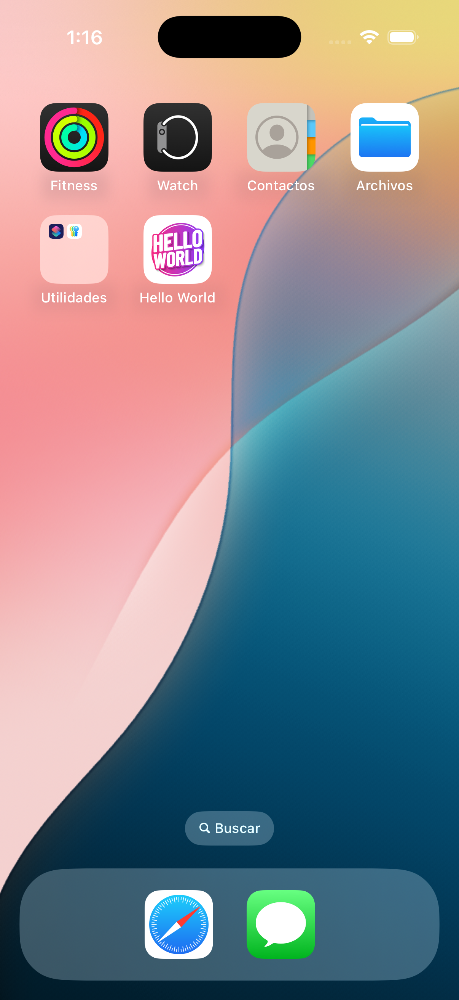
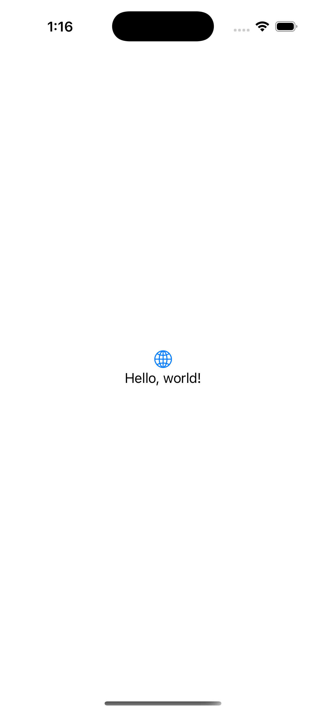

# Hello World with SwiftUI

Build the traditional "Hello World" application using SwiftUI's built-in state management

## Screenshots

The following are some screenshots for the iOS App:

<figure>
    
    <figcaption>Step 1 - The Launcher App on iPhone 16 Pro!</figcaption>
</figure>

<figure>
    
    <figcaption>Step 2 - The Hello World App on iPhone 16 Pro!</figcaption>
</figure>

## License

It under the MIT License, checkout at the [LICENSE](../LICENSE) file.
