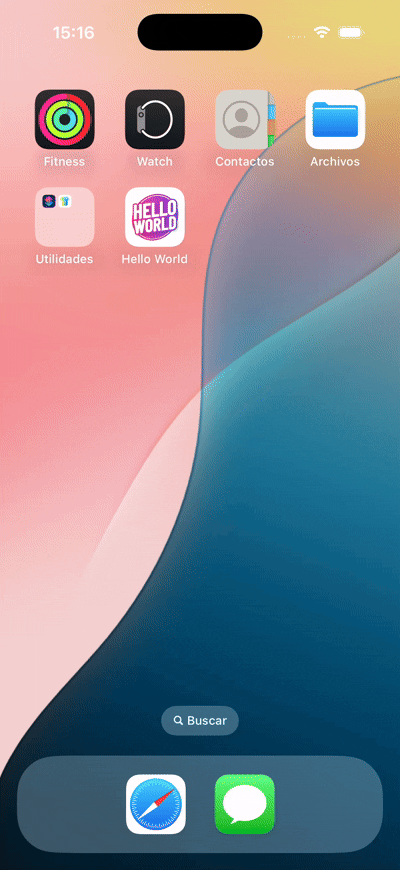

# Hello World with SwiftUI

Build the traditional "Hello World" application using SwiftUI's built-in state management

## Hello World Examples

The following are some "Hello World" Examples for the iOS App:

[Hello World Basic App](./HelloWorldBasic/README.md)

A "Hello World" Basic App with static message.

---

[Hello World App with New Message](./HelloWorldTextField/README.md)

A "Hello World" App with a new message.

## License

It under the MIT License, checkout at the [LICENSE](./LICENSE) file.
