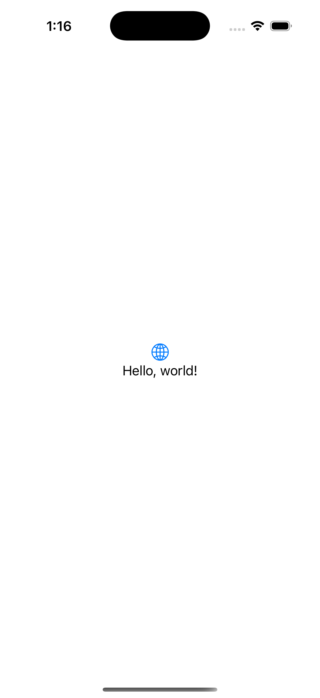

# Hello World with SwiftUI

Build the traditional "Hello World" application using SwiftUI's built-in state management

## Hello World Examples

The following are some "Hello World" Examples for the iOS App:

The [Hello World Basic App](./HelloWorldBasic/README.md) on iPhone 16 Pro!

The [Hello World App with New Message](./HelloWorldTextField/README.md) on iPhone 16 Pro!

## License

It under the MIT License, checkout at the [LICENSE](./LICENSE) file.
